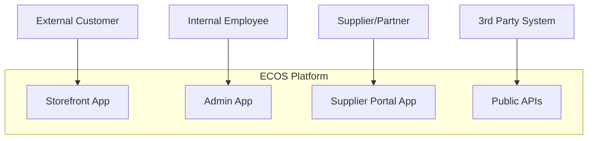

# Platform Architecture: Enterprise Commerce Operating System (ECOS)

## 1. Guiding Architectural Principles

The ECOS architecture is designed to support the mission of a profit-maximizing, risk-aware, and intelligent commerce platform. It is built for enterprise scale, long-term maintainability, and continuous evolution. Our architecture is founded on three primary paradigms:

1.  **Domain-Driven Design (DDD):** The system is decomposed into explicit, non-overlapping business domains. Each domain is a self-contained unit with its own data, logic, and APIs. This enforces clear ownership and separation of concerns.
2.  **Event-Driven Architecture (EDA):** Domains communicate asynchronously via a central, high-throughput Event Bus. This decouples services, enables massive parallelism, provides a natural audit trail, and allows for new capabilities to be added by simply subscribing to existing event streams.
3.  **API-First & Composable Services:** All domain capabilities are exposed through versioned, well-defined APIs. The platform's applications (e.g., storefront, admin portal) are "composed" from these underlying services, not built as monolithic structures.

## 2. High-Level System View (C1: System Context)

The ECOS is an operating system. External users, internal administrators, suppliers, and third-party systems interact with it through a suite of applications and APIs, all of which are clients of the core platform.



## 3. Core Architectural Components (C2: Containers/Services)

The ECOS is composed of three main types of components:
- **Applications:** User-facing clients (e.g., Next.js/React websites).
- **Domains (Services):** The core backend services, each representing a specific business domain.
- **Platform Infrastructure:** The foundational services that support the entire OS.

```mermaid
graph TD
    subgraph Applications
        Storefront
        AdminPortal
    end

    subgraph Core Domains (Packages)
        D_Catalog[Catalog Service]
        D_Pricing[Pricing Service]
        D_Risk[Risk Service]
        D_Orders[Orders Service]
        D_Decision[Decision Engine]
        D_More[...]
    end

    subgraph Platform Infrastructure
        PostgreSQL
        Redis
        EventBus[Event Bus (e.g., Kafka)]
        AuthN[Authentication Service]
        AuthZ[Authorization Service (RBAC)]
        AuditLog[Audit Log Service]
        Telemetry[Observability Platform]
    end

    Storefront --> D_Catalog
    Storefront --> D_Pricing
    Storefront --> D_Orders

    AdminPortal --> D_Risk
    AdminPortal --> D_More

    D_Catalog -- "Publishes CatalogUpdated Event" --> EventBus
    D_Pricing -- "Publishes PriceRecommended Event" --> EventBus
    D_Risk -- "Publishes RiskAssessed Event" --> EventBus
    EventBus -- "Events" --> D_Decision
    EventBus -- "Events" --> AuditLog
    EventBus -- "Events" --> Telemetry

    D_Decision -- "Makes final decision" --> D_Catalog

    D_Orders -- "Uses" --> PostgreSQL
    D_Pricing -- "Uses" --> Redis
    D_Risk -- "Uses" --> AuthZ
```

## 4. Repository Structure: Monorepo

To manage the complexity of dozens of domains and applications, we will use a monorepo structure powered by a modern build system (e.g., Nx, Turborepo).

```
/
├── apps/
│   ├── storefront/      # Customer-facing Next.js application
│   └── admin/           # Internal admin portal application
│
├── packages/
│   ├── 00-governance/   # Core interfaces, event schemas
│   ├── 01-identity/
│   ├── 02-customer/
│   ├── 03-catalog/      # Catalog domain service, schema, and API
│   ├── 04-product-information-management/
│   ├── 05-supplier-intelligence/
│   ├── 06-inventory-intelligence/
│   ├── 07-pricing-intelligence/
│   ├── ... (all other domains)
│   └── 30-platform-operations/
│
├── infrastructure/
│   ├── terraform/       # Infrastructure as Code for all environments
│   └── kubernetes/      # Kubernetes manifests
│
└── docs/
    ├── 000-vision.md
    └── 001-architecture.md
```

**Benefits of this structure:**
- **Atomic Changes:** A single pull request can modify a domain's API, its database schema, and the consuming application code, ensuring consistency.
- **Simplified Dependency Management:** No need to publish and version-manage dozens of internal packages.
- **Code Sharing:** Facilitates sharing of common libraries, UI components, and type definitions.
- **Consistent Tooling:** A single set of tools for linting, testing, and building across the entire platform.

## 5. The Event Bus: The Platform's Nervous System

The Event Bus is the central communication backbone. Every domain interaction is modeled as an event.

- **Technology:** A durable, high-throughput, partitioned log system like Apache Kafka is the canonical choice.
- **Schema:** All events will have a strictly enforced schema (e.g., Avro, Protobuf) registered in a central schema registry. This prevents breaking changes.
- **Immutability:** Events are immutable records of facts. They are never deleted and serve as the ultimate source of truth for analytics and auditing.
- **Topics:** Each event type will have its own topic (e.g., `orders.placed`, `pricing.recommendation.created`, `risk.assessment.completed`).

## 6. The Decision Engine: Centralized Orchestration

As per the vision, domains do not act on each other directly. They publish recommendations to the Event Bus. The Decision Engine consumes these recommendations and makes a final, authoritative decision.

**Example Workflow: Publishing a Product**
1.  **Supplier Intelligence** publishes `supplier.offer.updated`.
2.  **Inventory Intelligence** consumes this, updates its state, and publishes `inventory.stock-level.changed`.
3.  **Pricing Intelligence** consumes these, calculates a new price, and publishes `pricing.recommendation.created` with a suggested price and expected profit.
4.  **Risk Platform** assesses the product/supplier and publishes `risk.product-assessment.completed`.
5.  **Marketing** assesses demand and publishes `marketing.demand-score.updated`.
6.  The **Decision Engine** consumes all of these events. It evaluates the inputs against its central policy ruleset (e.g., "is margin > 15% AND risk score < 'HIGH' AND demand > 70?").
7.  If the policy passes, the Decision Engine invokes the **Catalog** service's API to formally `PublishProduct`, which in turn emits the final `catalog.product.published` event for the storefront to consume.

This workflow ensures that business policy is centralized and consistently applied, rather than being fragmented across multiple services.
