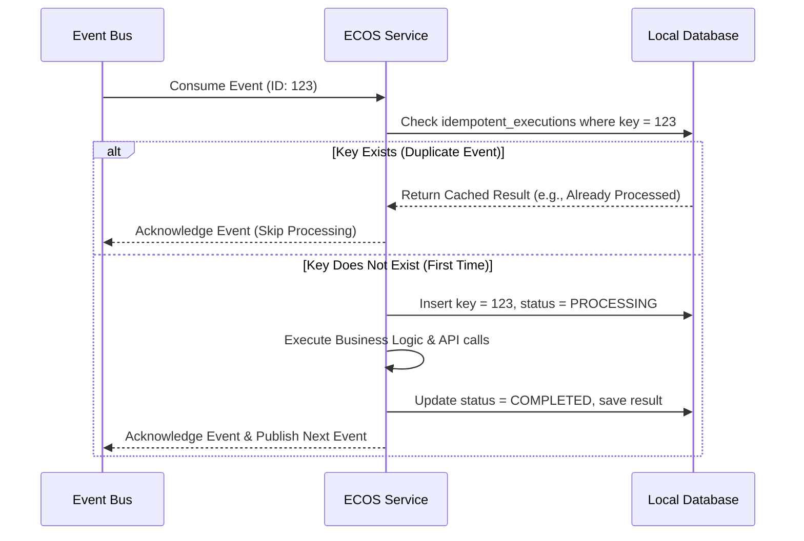

# Chaos & Operational Resilience Specification

## 1. The Reality of Distributed Chaos

In the ECOS platform, we design for failure. We assume that:
- Any external API (Stripe, Mercury, Avalara, Distributor A) will timeout, fail, or return inconsistent responses.
- The network will duplicate, delay, or drop events.
- Services will restart unexpectedly.
- Database connections will occasionally saturate or disconnect.

To "handle chaos with grace" means ECOS must never lose a customer's money, never double-charge an account, never double-issue a purchase order, and never leave its General Ledger in an unbalanced state. Data and financial integrity are absolute.

## 2. Strict Idempotency Guards

Every service that performs a state change or an external action (API call, database write, event publication) must be guarded by an **Idempotency Key**.

- **Definition:** The idempotency key is typically the `correlationId` or `eventId` of the incoming triggering event.
- **The Guard Pattern:**
  1.  Upon consuming an event, the service starts a database transaction.
  2.  It checks an `idempotent_executions` table for the incoming key.
  3.  **If the key exists:** The service bypasses processing and immediately returns the cached response or status of the original, successful execution.
  4.  **If the key does not exist:** The service records the key with a status of `PROCESSING`, performs the business logic (including any external API calls), updates the status to `COMPLETED`, saves the output payload, and commits the transaction.
- **Scope:** Idempotency is enforced globally. No double-billing at checkout; no duplicate Purchase Orders in procurement; no duplicate journal entries in the General Ledger.

## 3. Coordinated Rollbacks (The Saga Pattern)

When a multi-service business transaction fails halfway through, we do not perform database-level rollbacks across services (which is impossible and couples databases). Instead, we use the **Orchestrated Saga Pattern**.

- **Orchestrator:** The **Decision Engine** acts as the Saga Orchestrator for high-value business flows.
- **Workflow State:** The orchestrator maintains a persisted state machine of the active saga.
- **Compensating Transactions:** For every positive action performed by a service (e.g., `Reserve Funds`), a matching **Compensating Command** must be defined to reverse its effects (e.g., `Release Funds`).

### Example: Shipment Rejected by Distributor After Payment
1.  **Checkout** succeeds; **Payment** captured.
2.  **Tax Compliance** records liability ($80.00).
3.  **Treasury** transfers $80.00 to the Tax Reserve.
4.  **Procurement** creates a B2B Purchase Order ($750.00) for Distributor A.
5.  **Distributor A** rejects the shipment due to sudden stockout (`distributor.shipment.rejected`).
6.  The **Decision Engine (Orchestrator)** consumes this rejection and triggers the following **Compensating Commands**:
    -   `procurement.purchase_order.cancel` -> Cancels the PO and marks it as void.
    -   `treasury.reserve-transfer.reverse` -> Initiates bank API transfer to move $80.00 back from the Tax Reserve to Operating Cash.
    -   `accounting.journal-entry.reverse` -> Posts a balancing, offset journal entry to negate the sales and tax revenue lines.
    -   `payments.payment.refund` -> Refunds the customer's credit card.
    -   `orders.order.cancel` -> Transitions order status to `CANCELLED` and triggers customer notification.

This ensures that even when a physical shipment fails, ECOS's financial books and bank accounts resolve to a perfectly consistent state.

## 4. Resilient API Integration: Circuit Breakers & Retries

All outbound integrations with third-party APIs (Stripe, Mercury, Avalara, Distributor APIs) must be protected by resiliency patterns:

- **Exponential Backoff with Jitter:** When an API request fails due to a network glitch or 5xx server error, the service retries the request. The delay between retries increases exponentially (e.g., 1s, 2s, 4s, 8s), and random noise ("jitter") is added to prevent all retries from hitting the target server simultaneously (thundering herd problem).
- **Circuit Breakers:** If an external API fails repeatedly (e.g., 5 consecutive timeouts or 5xx errors), the **Circuit Breaker** "opens."
  -   While open, all subsequent requests to that API fail immediately *without* attempting to call the network, saving resource threads.
  -   After a cooldown period (e.g., 60 seconds), the circuit enters a "half-open" state, allowing a single request through. If it succeeds, the circuit closes (normal operation); if it fails, the circuit opens again.

## 5. Dead-Letter Queues (DLQ) & Operator Interventions

If an event fails validation (e.g., corrupt schema) or repeatedly fails business processing even after maximum retries and backoff:
- The event is **never dropped**.
- The consumer catches the failure, removes the event from the main queue, and publishes it to a **Dead-Letter Queue (DLQ)**.
- **Alerting:** An alert is instantly triggered in the **Operations Dashboard**.
- **Quarantine:** The specific order or entity is placed in a `MANUAL_REVIEW` or `SYSTEM_EXCEPTION` hold.
- **Rescue Workflow:** Internal administrators can inspect the quarantined event in the admin dashboard, fix the underlying issue (e.g., correct a mismatched billing zip code or select an alternate supplier), and click **Replay Event** to inject it back into the primary processing pipeline.

## 6. Graceful Degradation (Fallback Modes)

If a critical third-party dependency is completely offline, ECOS must gracefully degrade its experience rather than crashing checkout:
- **Offline Tax Fallback:** If the external Tax Provider is offline, the ECOS Tax Compliance service falls back to a locally cached, conservative flat-tax rate database (by state) to capture the order, and flags the transaction for automatic reconciliation once the tax provider is back online.
- **Offline Pricing Fallback:** If the real-time competitor price feed is offline, the Pricing Engine falls back to standard markup percentages on cost, allowing products to remain listed without risk-exposure.
- **Manual Fulfillment Handover:** If a distributor's API goes offline for hours, the Fulfillment Engine queues the PO requests locally in a `PENDING_TRANSMISSION` state and automatically processes them the moment the connection is re-established.
