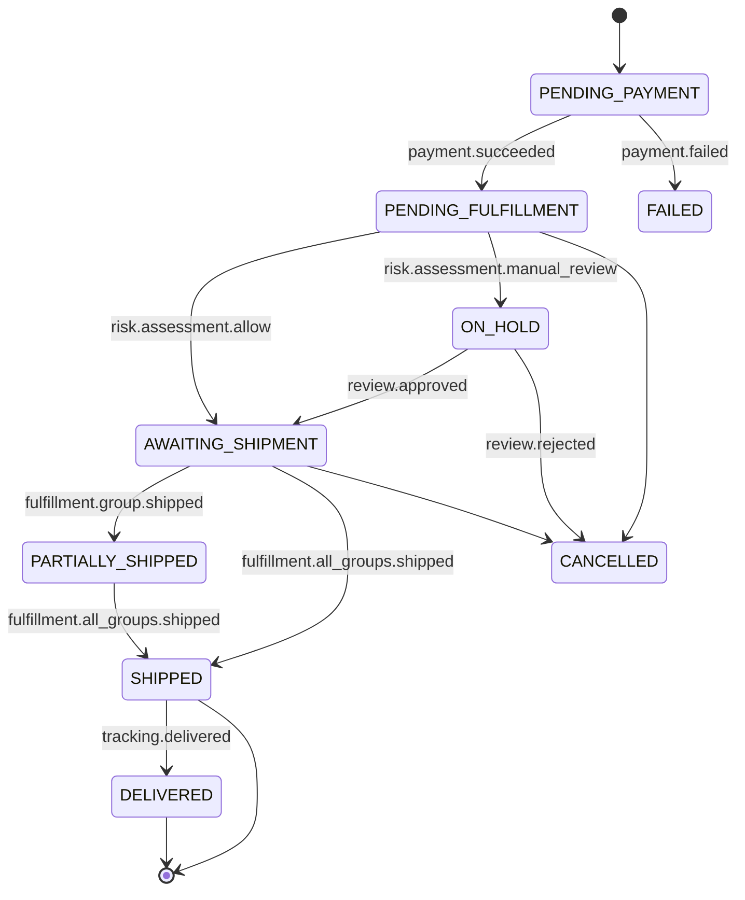

# Orders & Order Management System (OMS)

## 1. Domain Definition

The Orders domain is the authoritative source of truth for all customer purchases. It acts as the central hub that orchestrates the entire post-purchase lifecycle, from the moment a checkout is successfully completed to the final delivery and settlement.

- **Bounded Context:** This domain's responsibility begins when the Checkout domain successfully processes a payment and creates an order. Its context includes the order's contents, customer information, fulfillment status, and financial totals. It is a consumer of decisions from the Risk and Fraud domains and a producer of events that trigger the Fulfillment, Finance, and Customer Service domains. It does not handle the fulfillment logic itself, only the state of the order as it moves through the fulfillment process.
- **Core Services:**
    - **Order Service:** Provides APIs to create, retrieve, and update the state of orders.
    - **Order State Machine:** An internal service that manages the lifecycle of an order, ensuring it moves through valid states (e.g., from `PENDING_FULFILLMENT` to `SHIPPED`).

## 2. Key Performance Indicators (KPIs)

- **Order Cycle Time:** Average time from `order.placed` to `order.delivered`.
- **Order Accuracy:** Percentage of orders fulfilled without errors (e.g., wrong items, wrong address).
- **Fulfillment Cost per Order:** Average operational cost to process and fulfill an order.
- **Order Cancellation Rate:** Percentage of placed orders that are later cancelled.

## 3. Data Model

The Order data model is designed to be a comprehensive, auditable record of a transaction.

### Core Tables

- **`orders`**: The master record for a customer's purchase.
  - `order_id` (PK), `customer_id` (FK), `status` (see state machine below), `total_price_cents`, `tax_cents`, `shipping_cents`, `discount_cents`, `currency`, `shipping_address` (JSONB), `billing_address` (JSONB), `placed_at`, `fulfilled_at`, `cancelled_at`.
- **`order_line_items`**: The individual items within an order.
  - `line_item_id` (PK), `order_id` (FK), `sku`, `product_title`, `quantity`, `unit_price_cents`, `total_price_cents`.
- **`fulfillment_groups`**: A group of line items to be fulfilled together from a specific source. An order can have multiple fulfillment groups (e.g., one from our warehouse, one dropshipped from a supplier).
  - `fulfillment_group_id` (PK), `order_id` (FK), `status` (PENDING, SHIPPED, DELIVERED), `fulfillment_source_type` (WAREHOUSE, SUPPLIER), `source_id` (e.g., warehouse_id or supplier_id), `tracking_number`, `carrier`, `shipped_at`, `delivered_at`.
- **`fulfillment_group_items`**: A join table linking line items to their fulfillment group.
  - `fulfillment_group_id` (FK), `line_item_id` (FK).
- **`order_state_transitions`**: An immutable log of every status change for an order, providing a full audit trail.
  - `transition_id` (PK), `order_id` (FK), `from_status`, `to_status`, `reason`, `timestamp`.

### Order Status State Machine

Orders can only transition between valid states.

## 4. API Contracts (Conceptual)

- `POST /v1/orders`: Create a new order (typically called by the Checkout service).
- `GET /v1/orders`: List orders (highly restricted access).
- `GET /v1/orders/{id}`: Retrieve a single order's complete details.
- `POST /v1/orders/{id}/cancel`: Request to cancel an order.

## 5. Key Events

### Consumed
- `checkout.completed`
- `payment.succeeded`
- `risk.assessment.completed`
- `fulfillment.group.shipped` (from Fulfillment domain)

### Published
- **`order.placed`**: The primary event signaling a new, valid order has entered the system and is ready for the post-purchase lifecycle. This is a critical trigger for many other domains.
  - **Payload**: The full order and line item details.
- **`order.status.updated`**: A generic event for any change in the order's status.
  - **Payload**: `order_id`, `new_status`, `previous_status`.
- **`order.fulfilled`**: Fired when all fulfillment groups for an order are in the `SHIPPED` or `DELIVERED` state.
  - **Payload**: `order_id`, `fulfilled_at`.
- **`order.cancelled`**: Fired when an order is cancelled.
  - **Payload**: `order_id`, `reason`.
- **`order.shipment.tracking_updated`**: Fired when a tracking number is added to a fulfillment group.
  - **Payload**: `order_id`, `fulfillment_group_id`, `tracking_number`.
