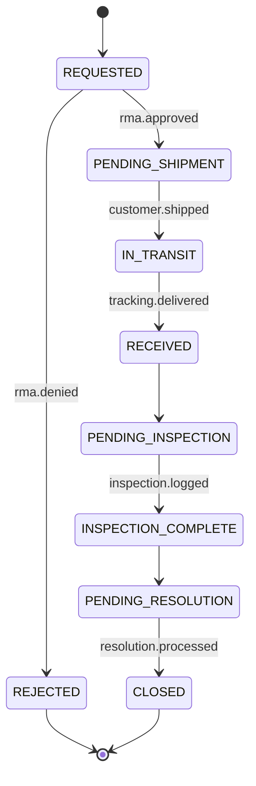

# Returns & Reverse Logistics

## 1. Domain Definition

The Returns domain manages the complete lifecycle of a product return, often called reverse logistics. It is a critical domain for customer satisfaction, but also a significant source of financial loss and risk. This domain's primary goal is to process returns efficiently, accurately, and in accordance with platform policy.

- **Bounded Context:** The Returns domain is activated when a customer decides to return an item from a delivered order. Its context includes the Return Merchandise Authorization (RMA), the status of the return shipment, the inspection and grading of the returned item, and the final resolution (refund, replacement, etc.). It publishes events that are consumed by the Finance domain (to process refunds), the Inventory domain (to update stock levels of returned goods), and the Risk domain (to update customer trust scores).
- **Core Services:**
    - **RMA Service:** Provides APIs for customers to initiate returns and for internal staff to manage them.
    - **Return State Machine:** Manages the lifecycle of an RMA, from `REQUESTED` to `CLOSED`.
    - **Inspection Service:** An internal service or interface for warehouse staff to log the condition of returned items.

## 2. Key Performance Indicators (KPIs)

- **Return Rate (by SKU, category, brand):** Percentage of items sold that are returned.
- **Time to Refund:** Average time from `return.received` to the issuance of a refund.
- **Restocking Rate:** Percentage of returned items that are deemed sellable and are returned to inventory.
- **Return Reason Analysis:** A breakdown of the most common reasons customers cite for returns.

## 3. Data Model

The data model for returns is centered around the RMA record.

### Core Tables

- **`rmas`** (Return Merchandise Authorizations): The master record for a return request.
  - `rma_id` (PK), `order_id` (FK), `customer_id` (FK), `status` (see state machine below), `reason_code`, `customer_comments`, `requested_at`, `closed_at`.
- **`rma_line_items`**: The specific items being returned as part of an RMA.
  - `rma_line_item_id` (PK), `rma_id` (FK), `order_line_item_id` (FK), `sku`, `quantity`.
- **`return_shipments`**: Tracks the physical shipment of the returned item from the customer.
  - `return_shipment_id` (PK), `rma_id` (FK), `carrier`, `tracking_number`, `shipping_label_url`, `status` (IN_TRANSIT, RECEIVED, INSPECTION_PENDING), `sent_by_customer_at`, `received_at`.
- **`return_inspections`**: A log of the inspection results for a returned item.
  - `inspection_id` (PK), `rma_line_item_id` (FK), `inspected_by_user_id`, `grade` (SEALED, OPEN_BOX, DAMAGED, WRONG_ITEM), `notes`, `inspected_at`.
- **`rma_resolutions`**: The final outcome of an RMA.
  - `resolution_id` (PK), `rma_id` (FK), `resolution_type` (REFUND, REPLACEMENT, STORE_CREDIT), `amount_cents` (for refunds/credit), `replacement_order_id` (FK), `created_at`.

### RMA Status State Machine

## 4. API Contracts (Conceptual)

- `POST /v1/returns`: Customer-facing endpoint to initiate a return request for an order.
- `GET /v1/returns/{id}`: Customer-facing endpoint to check the status of a return.
- `GET /v1/admin/returns`: Internal endpoint to list RMAs needing action (e.g., pending inspection).
- `POST /v1/admin/returns/{id}/inspections`: Internal endpoint for warehouse staff to submit inspection results.
- `POST /v1/admin/returns/{id}/resolutions`: Internal endpoint for customer service to process the final resolution.

## 5. Key Events

### Consumed
- `order.delivered` (to determine eligibility for returns)

### Published
- **`return.request.created`**: Signals a new RMA has been initiated by a customer. Consumed by Risk to analyze customer behavior.
  - **Payload**: `rma_id`, `order_id`, `customer_id`, `sku`, `reason_code`.
- **`return.received`**: Signals that a returned item has arrived at the warehouse and is pending inspection.
  - **Payload**: `rma_id`, `tracking_number`, `received_at`.
- **`return.inspection.completed`**: Provides the results of the physical inspection.
  - **Payload**: `rma_id`, `sku`, `grade`, `notes`.
- **`return.resolution.completed`**: The final event in the lifecycle. This is a critical trigger for other domains.
  - **Payload**: `rma_id`, `order_id`, `customer_id`, `resolution_type`, `amount_cents`.
  - **Consumers**:
      - **Finance Domain:** Initiates the refund to the customer's original payment method.
      - **Inventory Domain:** Creates a ledger entry to add the item back to stock if the grade is sellable.
      - **Risk Domain:** Updates the customer's trust score.
      - **Orders Domain:** Creates a new order if the resolution was a replacement.
